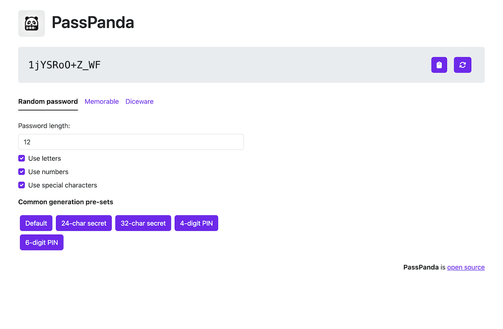
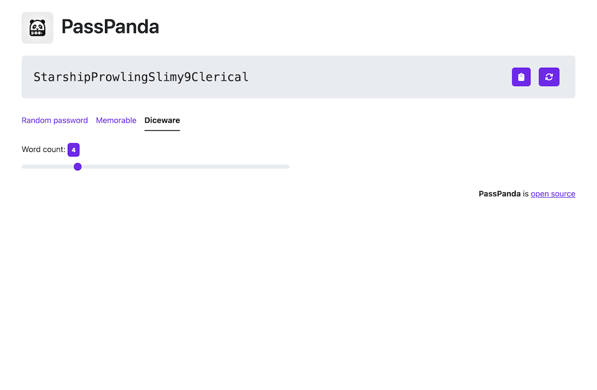

<p align="center">
    
</p>

<h1 align="center">PassPanda</h1>
<p align="center">Instantly create robust passwords and passphrases on the web</p>

<p align="center">
    <a href="https://github.com/jarne/passpanda/blob/main/package.json">
        
    </a>
    <a href="https://github.com/jarne/passpanda/actions/workflows/build-deploy.yml">
        
    </a>
    <a href="https://github.com/jarne/passpanda/blob/main/LICENSE">
        
    </a>
</p>

## 📙 Description

PassPanda is a user-friendly static web application designed to facilitate the generation of secure passwords and Diceware passphrases.

### Features

- **Password Generation**

    - Users can generate common passwords with customizable parameters such as length and inclusion of letters, numbers, and special characters.

- **Diceware Passphrase Generation**

    - PassPanda offers the generation of Diceware passphrases, leveraging the renowned method of creating strong yet memorable passwords through randomly selected words.

- Clipboard Copy Functionality
- Regenerate Button
- Dark Mode

### Screenshots





### Architecture

PassPanda is a static web app based on the React framework and Bootstrap as a style framework.
It uses the [omgopass](https://github.com/Omgovich/omgopass) library for generating memorable passwords.
For generating common passwords and diceware passphrases, a implementation inside this application is used.
They both use the browser's secure `crypto.getRandomValues` API, and diceware passphrases are
based on the [EFF word list](https://www.eff.org/files/2016/07/18/eff_large_wordlist.txt).

## 🖥 Usage

### Using the hosted version of the app

Use the hosted version at [pass.wayspace.net](https://pass.wayspace.net).

### Build it locally

Clone the repository and install the dependencies using:

```
$ yarn install
```

Then run this command to build the web app:

```
$ yarn build
```

The built website will be available in the `dist`-folder, just open the `index.html`-file in your browser or upload the files to a web server.

## 🙋‍ Contribution

Contributions are always very welcome! It's completely equal if you're a beginner or a more experienced developer.

Thanks for your interest 🎉👍!

## 👨‍⚖️ License

[MIT](https://github.com/jarne/passpanda/blob/main/LICENSE)
